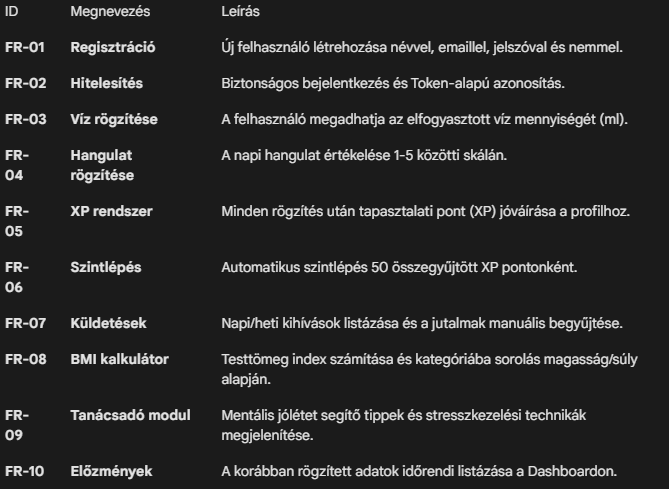

# Követelmény Specifikáció (Requirements Specification)

## 1. Bevezetés
Ez a dokumentum a Boosted alkalmazás funkcionális és nem funkcionális követelményeit rögzíti. A specifikáció célja, hogy pontos képet adjon a szoftver képességeiről, korlátairól és a felhasználói elvárásokról.

## 2. Felhasználói célcsoport
Az alkalmazás elsődleges célcsoportja azon személyek köre, akik:

Szeretnék nyomon követni napi vízfogyasztásukat és mentális állapotukat.

Motivációt keresnek az egészségesebb életmódhoz játékos elemeken keresztül.

Egyszerű, gyors és modern felületet keresnek bonyolult fitnesz-rendszerek helyett.

## 3. Funkcionális követelmények (Functional Requirements)
A funkcionális követelmények leírják, hogy a rendszernek milyen feladatokat kell elvégeznie.

## 4. Nem funkcionális követelmények (Non-functional Requirements)
Ezek a követelmények a rendszer minőségére és működési tulajdonságaira vonatkoznak.

* **4.1.** Felhasználói felület (UI/UX)

    **Modern dizájn:** Az alkalmazásnak követnie kell a "Glassmorphism" stílusjegyeket (átlátszóság, elmosódott hátterek).

    **Reszponzivitás:** A felületnek mobil és asztali böngészőben is olvashatónak kell lennie.

    **Vizuális visszacsatolás:** Minden gombnyomásra és sikeres mentésre animációval vagy üzenettel kell reagálnia a rendszernek.

* **4.2.** Teljesítmény és Skálázhatóság

    **API válaszidő:** A backend kérések feldolgozása nem haladhatja meg az 500ms-ot (helyi hálózaton).

    **Könnyű architektúra:** A FastAPI használatával a rendszernek minimális erőforrás-igényűnek kell lennie.

* **4.3.** Biztonság

    **Adatvalidáció:** A backendnek ellenőriznie kell a bemeneti adatokat (pl. ne lehessen negatív vizet rögzíteni).

    **Azonosítás:** Az API végpontok védelme Header-alapú hitelesítéssel.

## 6. Jövőbeli fejlesztési lehetőségek
A követelmények bővítése a következő fázisban:

* **Valós idejű AI-alapú chat-asszisztens (LLM) integrációja.**

* **Google/Apple Health integráció az adatok automatikus szinkronizálásához.**

* **Social funkciók (barátok felvétele, közös kihívások).**